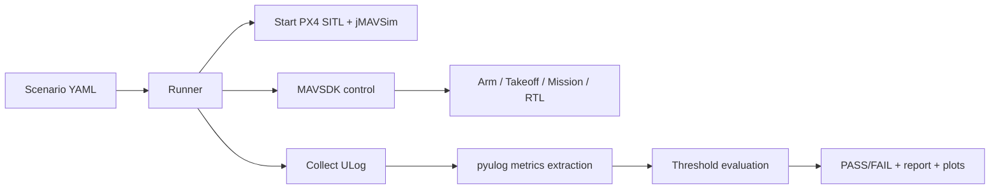

# Architecture

This lab is deliberately small but “real”:

- **PX4** is treated as an *external pinned dependency*.
- Each **scenario** is a YAML file with:
  - Mission definition (relative waypoints)
  - Scheduled events (parameter changes, failure injection)
  - Pass/fail thresholds (metrics gates)
- Each run produces **ULog** + **metrics** + **plots** + **Markdown report**.

## Data flow

## Why this design

- If you can’t reproduce a run, you can’t debug it.
- If you don’t have artifacts, you can’t prove anything.
- If you don’t gate on metrics, regressions slip in silently.
